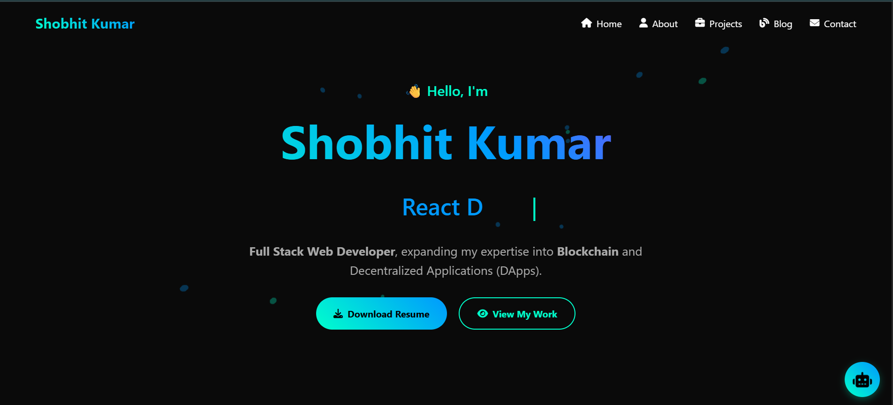
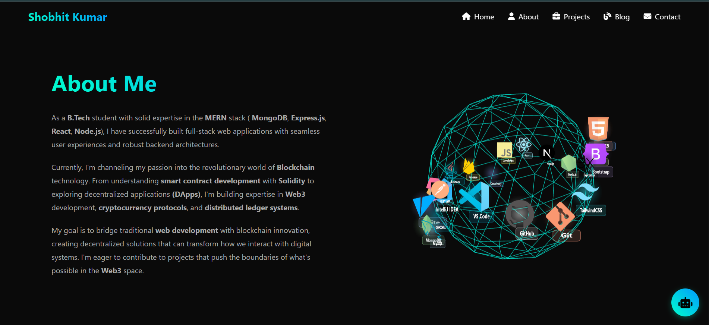
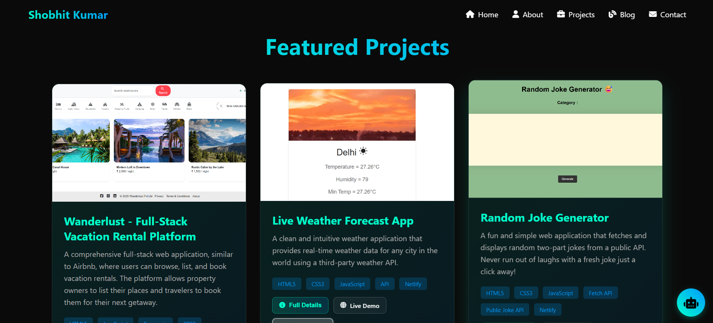
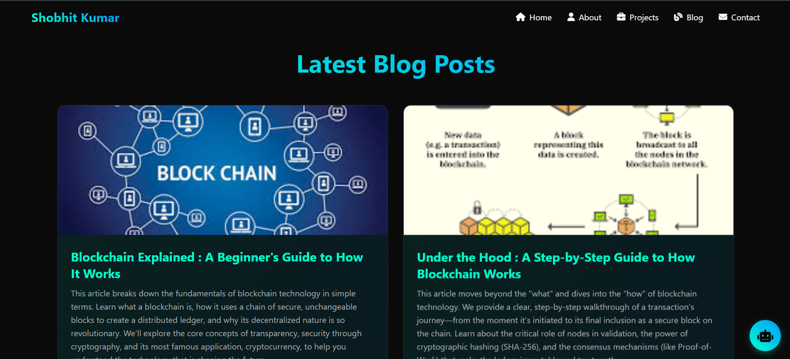
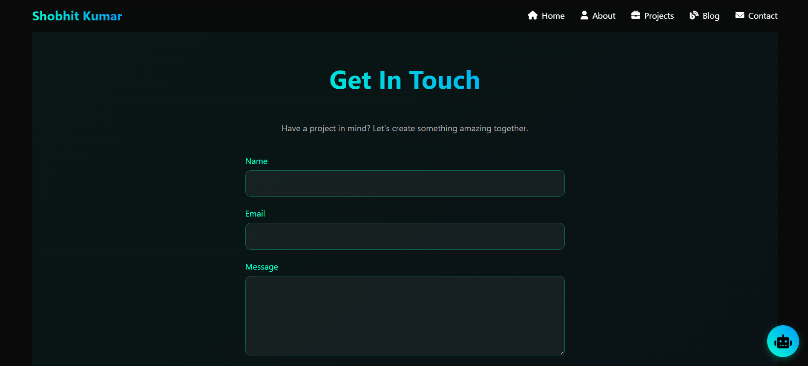

# 💼 Shobhit Kumar — 3D Portfolio with AI Assistant

Welcome to my personal portfolio website!  
This project showcases my skills, projects, experience, and contact information as a Frontend Developer, IoT & Blockchain Enthusiast.
A modern, responsive developer portfolio featuring Three.js 3D visuals, animated sections, dynamic project overlays, a blog section, and a built-in AI chatbot with voice input, search, export, and clickable project actions.

  

## 🚀 Live Demo

🌐 [Click here to view the portfolio](https://kumarshobhit.tech)

---

## 📸 Screenshots

---

## ✨ Features

- 3D Hero Scene
  - Three.js ambient floating elements with mouse-reactive camera
  - Smooth animations and performance-conscious rendering
- About: Tech Stack Orbit
  - 3D orbit of tech logos and labeled pills (sprites), depth-sorted for blend quality
- Projects
  - Dynamic project cards with background images loaded from dataset
  - Inline actions: Full Details, Live Demo, Source Code
  - Full-screen detail overlay with gallery, tech tags, and action buttons
  - View More/View Less toggling
- Blog
  - Latest posts with “Read More” external links
  - View More/View Less toggling
- AI Chatbot
  - Modal chat UI with greeting, typing indicator, reactions, copy, search, export, and clear
  - Voice input using Web Speech API (when supported)
  - Context-aware responses about skills, projects, contact, blockchain, and more
  - Project deep-links rendered as styled, clickable buttons (Live Demo / Source Code)
  - Local history (persisted in localStorage)
- Contact
  - Formspree-powered contact form with success/error toasts
- UX & Performance
  - Mobile nav with scroll lock, swipe-close, Escape key handling
  - IntersectionObserver for fade-in animations
  - Resize throttling and defensive checks for 3D canvases

---

## 🛠 Built With

- HTML5, CSS3 (responsive layout)
- Vanilla JavaScript (ES6+)
- Three.js (3D scenes)
- Font Awesome (icons via CDN)
- Formspree (contact form endpoint)

---

## 📬 Contact

Feel free to connect with me:

- 🔗 [LinkedIn](https://www.linkedin.com/in/shobhit-kumar1/)
- 📧 shobhitkumar1437@gmail.com
- 🌍 [Portfolio Website](https://kumarshobhit.tech)

---

## 🛡 Copyright Notice

© 2025 Shobhit Kumar — This portfolio is developed and maintained by Shobhit Kumar. All rights reserved.

